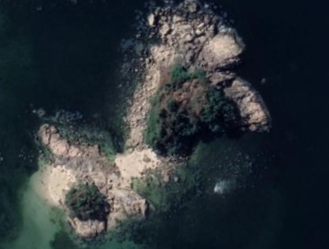
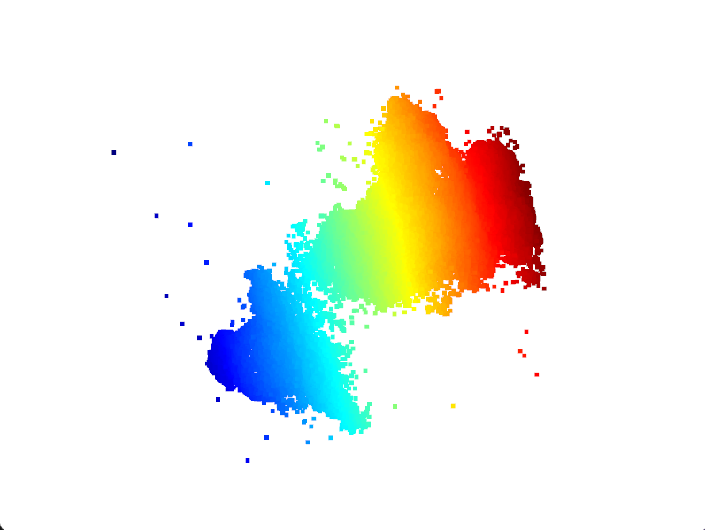
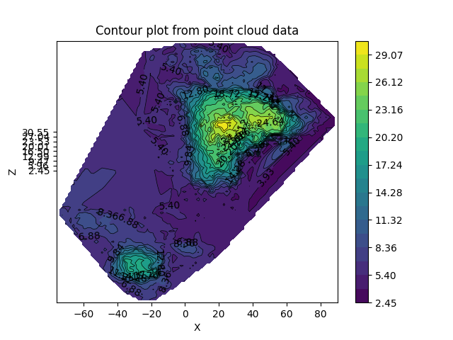

# Point Cloud to Contour Map

This repository provides a script to process point cloud data from a PLY file, generate contour maps, and optionally calculate contour areas.

## Installation

To set up the environment, follow these steps:

1. **Clone the repository**:
   ```sh
   git clone https://github.com/AGoodName244/Point_cloud_to_contour_map.git
2. **Create and activate the conda environment**:  
   ```sh
   conda env create -f environment.yml
   conda activate pccontour
3. **Install additional dependencies**:
   If you need to install additional dependencies, ensure they are added to your 'requirements.txt' or 'environment.yml'

## Script Usage
### Arguments Description
- `--ply_file`: (required) Path to the PLY file containing the point cloud data.
- `--output_dir`: (required) Directory to save the output contour map images.
- `--low`: (optional) Low height for area calculation.
- `--high`: (optional) High height for area calculation.
- `--contour_line_number`: (optional, default=20) Number of contour lines to generate.
- `--real_world_height`: (optional, default=15.0) Real world height corresponding to the height range in the data.

### Example Command

To run the script, please refer to the following command example:

> ./extract_pcd_to_contour_map.py --ply_file <path_to_ply_file> --output_dir <path_to_output_images_file> --contour_line_number 20 --real_world_height 30

Replace `<path_to_ply_file>` and `<path_to_output_images_file>` with the appropriate paths.


### Example Images

<div style="display: flex; flex-direction: row;">
  <div style="margin-right: 10px;">
    <h4>Real Image</h4>
    
  </div>
  <div style="margin-right: 10px;">
    <h4>Point Cloud</h4>
    
  </div>
  <div>
    <h4>Contour Map</h4>
    
  </div>
</div>

### Limitation

This project processes point cloud data to generate contour maps of an island. Due to the ebb and flow of the tide, the modeling information of the island will be affected by the water level. The script helps in visualizing these variations through contour maps.